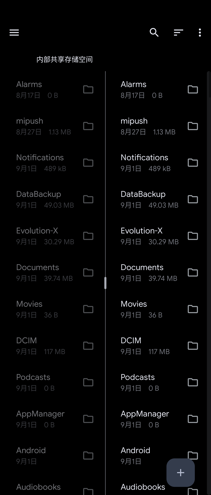
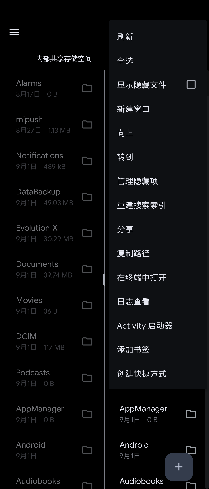
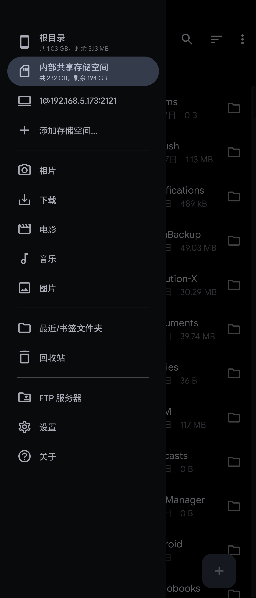
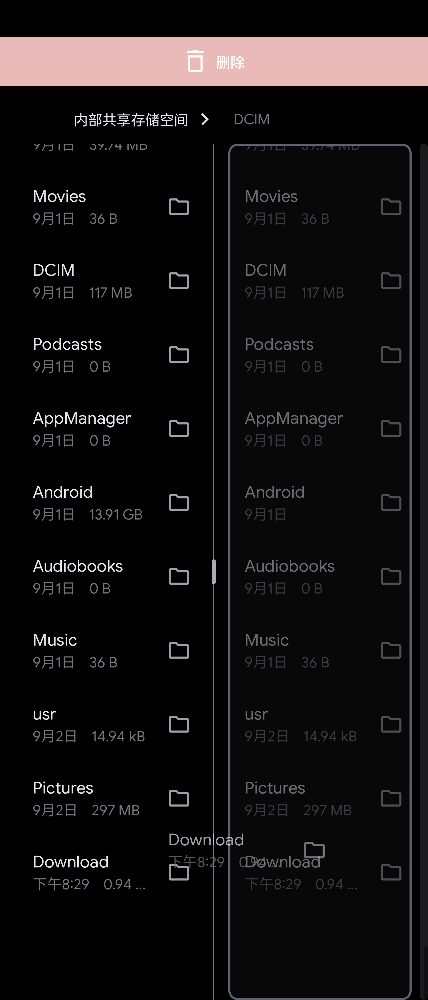

# 📦 Material Files · Sora-Editor 增强版

> ### 🚀 文件管理器 × APK 逆向分析工具箱
>
> 在 [Material Files](https://github.com/zhanghai/MaterialFiles)（Hai Zhang）与
> [Sora-Editor 分支](https://github.com/Citrinae-Lime/MaterialFiles.Sora-Editor)（Citrinae-Lime）的基础上，
> 深度融合 **MT 管理器风格逆向工具、内置终端、Everything 索引搜索**，打造 Android 上的文件与逆向利器。

---

## ✨ 特性总览

| 领域 | 能力 |
| --- | --- |
| 🕵️ **APK 逆向分析** | DEX 解析 / Smali 导出 / 引用跳转 / 字符串搜索 / ELF 分析 / Manifest 解码 / APK 对比 |
| ✍️ **APK 签名** | 一键签名（v1+v2+v3）· 自定义密钥库 · 带版本号重命名 · 直接安装 |
| 🖥️ **终端** | Termux 内核 · PTY 支持 · Root 会话 · 附加按键行 |
| 🔍 **超级搜索** | Everything 索引搜索（本地 + FTP/ETP）· 文件名索引 · 内容正则搜索 |
| 🧰 **文件增强** | 十六进制编辑 · 批量重命名 · 编码转换 · 时间戳编辑 · 隐藏文件管理 |

---

## 🛠️ 完整功能清单

本分支在 Sora-Editor 版基础上，提供一系列高级工具（**长按文件 → 更多操作**）：

### 🕵️ APK 逆向分析

- **DEX 分析器**：解析 APK 内的 DEX 文件（类 / 方法 / 字段 / 指令级），支持 **导出 Smali 源码**、正则搜索、**查找引用跳转**——类/方法/字段被谁引用，点击直达。
- **APK 字符串搜索**：在 DEX 与 .so 文件中批量搜索字符串。
- **ELF 分析器**：查看 .so 文件的 ELF 头、程序头、节区与字符串表。
- **十六进制查看器 / 编辑器**：任意文件的 Hex 查看与编辑。
- **AndroidManifest 解码**：AXML 二进制 XML → 可读文本（版本号、minSdk、targetSdk、组件等）。
- **APK 对比**：比较两个 APK 的签名信息是否一致。

### ✍️ 签名与安装

- **一键签名 APK**：使用内置自动生成的密钥一键签名（v1+v2+v3），无需任何配置。
- **签名 APK**：使用 **APK Signature Scheme v1 + v2 + v3** 签名（支持密钥库选择、密码输入），签名结果可正常安装于 Android 8.0+。
- **带版本号重命名**：自动读取 APK 版本名并重命名为 `名称_版本号.apk`。
- **安装 APK**：直接通过系统安装器安装 APK 文件。

### 🏖️ 终端与系统工具

- **内置终端**：基于 Termux 终端模拟器（PTY），文件列表菜单直接在当前目录打开终端，支持 **Root 会话**与 ESC / TAB / CTRL / ALT / 方向键等附加按键行。
- **Logcat 查看器**：Root 或非 Root 环境查看系统日志。
- **Activity 启动器**：列出已安装应用，启动任意 Activity。
- **显示 / 隐藏文件**：ES 文件管理器风格隐藏项管理。

### 🔥 搜索与索引

- **Everything 索引搜索**：集成 Everything 的 **ETP/FTP 协议**（`SITE EVERYTHING QUERY`），配置 Windows 索引根目录后即时搜索 FTP 服务器文件。
- **文件名索引搜索**：为目录建立可重建的文件名索引，海量目录毫秒检索。
- **文件内容搜索**：在当前目录递归搜索文本内容（区分大小写、仅文本过滤）。
- **搜索性能**：独立搜索线程 + 并行结果加载，顶层结果即时返回，超大目录不卡顿。

### 🧰 文件增强工具

- **批量重命名**：多选文件后统一加前缀 / 后缀、查找替换、自动编号。
- **文本编码转换**：UTF-8 / GBK / GB18030 / UTF-16 / BIG5 等编码互转。
- **时间戳编辑**：修改文件的修改时间。

> 📌 签名功能基于 BouncyCastle 自研实现，v1（JAR 签名）/ v2 / v3 均通过 `apksigner verify` 验证。

---

## 🏆 原版 Material Files 特性

- 🌿 **开源**：轻量、简洁并且安全。
- 🎨 **Material Design**：遵循 Material Design 规范，注重细节。
- 🧭 **面包屑导航栏**：点击导航栏所显示路径中的任一文件夹即可快速访问。
- 👑 **Root 支持**：使用 root 权限查看和管理文件。
- 📦 **压缩文件支持**：查看、提取和创建常见的压缩文件。
- 🗄️ **NAS 支持**：查看和管理 FTP、SFTP、SMB 和 WebDAV 服务器上的文件。
- 🌗 **主题**：可定制的界面颜色，可选纯黑夜间模式。
- 🐧 **Linux 友好**：类似 Nautilus，支持符号链接、文件权限和 SELinux 上下文。
- 🛡️ **健壮性**：基于 Linux 系统调用实现，而不是另一个 `ls` 解析器。
- ⚙️ **实现良好**：Java NIO2 文件 API 与 LiveData 架构。

---

## 📸 预览

 

---

## ⬇️ 下载安装

**点击下图前往 Release 下载最新版 APK**（GitHub Actions 自动构建，已签名）：

---

## 💖 鸣谢

- [Hai Zhang](https://github.com/zhanghai) —— 原版 **Material Files** 的作者，感谢他带来了如此优秀的开源文件管理器。
- [Citrinae-Lime](https://github.com/Citrinae-Lime) —— **Sora-Editor 版本分支**的作者，感谢他对原版的二次开发与维护。
- [Termux](https://github.com/termux) —— 终端模拟器内核与 Terminal View 组件。

---

## 🔧 在定制 ROM 中集成

如果您决定在您的定制 ROM 中集成这个应用，十分感谢！请遵循以下建议：

- 请不要使用这个应用替换 AOSP 的 [DocumentsUI](https://android.googlesource.com/platform/packages/apps/DocumentsUI/) 应用——这个应用不是 DocumentsUI 的替代品，且依赖 DocumentsUI 授予外置 SD 卡访问权限。
- 请确保应用可以被卸载或禁用。
- 请避免与 Play/F-Droid 版本冲突，若修改并重新签名请复刻本项目并重命名软件包名。

---

## 📄 许可证

    Copyright (C) 2024 Hai Zhang

    This program is free software: you can redistribute it and/or modify
    it under the terms of the GNU General Public License as published by
    the Free Software Foundation, either version 3 of the License, or
    (at your option) any later version.

    This program is distributed in the hope that it will be useful,
    but WITHOUT ANY WARRANTY; without even the implied warranty of
    MERCHANTABILITY or FITNESS FOR A PARTICULAR PURPOSE.  See the
    GNU General Public License for more details.

    You should have received a copy of the GNU General Public License
    along with this program.  If not, see <https://www.gnu.org/licenses/>.